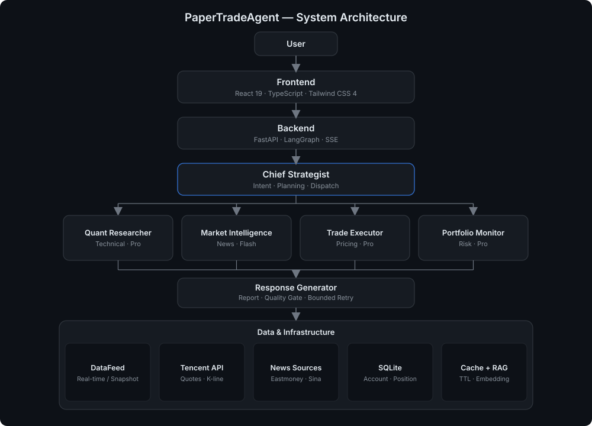

# <div align='center'>PaperTradeAgent<div>

<div align="center">


**面向投资小白的 A 股多智能体（Multi-Agent）模拟交易与金融素养教育系统 —— 由 LangGraph 协调 6 个 LLM Agent，在真实券商规则下练习交易、积累金融知识，同时是一套开箱即用的 AI Agent 应用开发参考实现。**

[English](README.md) · [简体中文](README.zh-CN.md)


*关键词：`多智能体` · `Multi-Agent` · `AI Agent` · `大模型` · `LLM` · `LangGraph` · `模拟交易` · `纸面交易` · `A股` · `量化分析` · `RAG` · `智能投顾` · `投资者教育` · `风控` · `开源` · `全栈`*

</div>

> **当前为测试版本（Beta）**：本项目目前处于测试阶段，功能与体验仍在持续迭代中。我们非常期待你的**使用与反馈**——无论是 bug 报告、改进建议还是新功能想法，都欢迎通过 [GitHub Issues](https://github.com/supersyh-sss/PaperTradeAgent-CN/issues) 告诉我们，你的反馈将直接影响项目的迭代方向。

> **⚠️ 仅用于教育模拟，不构成投资建议。** PaperTradeAgent 是一个**模拟交易（Paper Trading）沙盒**，旨在帮助**投资小白**建立信心、练习交易操作、积累金融知识。它**不用于真实投资**——市场本身存在不确定性，算法有意做了简化，且项目并不运行在专业量化所需的硬件与数据资源之上。

PaperTradeAgent 是一个开源的全栈项目，用 LangGraph 协调 6 个 LLM Agent 来模拟 A 股交易，覆盖自选股、实时行情、多智能体分析、下单、撮合、持仓结算、风控监控，并遵循真实券商规则。

行情与新闻数据全部来自免费的第三方数据源：行情与 K 线来自腾讯财经，新闻来自东方财富、财联社、新浪，并接入 DuckDuckGo 全网搜索兜底。项目也可作为在 T+1、涨跌停、交易日历、佣金、印花税等硬约束下构建多智能体 / Agentic AI 系统的参考实现。

## 快速启动

### 1. 前置依赖

本项目需要以下工具。若已安装可跳过对应步骤。

| 依赖 | 版本要求 | 用途 |
|------|---------|------|
| Python | 3.11+ | 后端运行时 |
| uv | 最新版 | Python 依赖与虚拟环境管理（Astral 出品，替代 pip + venv） |
| Node.js（含 npm） | 18+（推荐 20 LTS） | 前端运行时与包管理 |

**安装 Python**：前往 [python.org](https://www.python.org/downloads/) 下载 3.11+ 安装包；Windows 安装时务必勾选「Add Python to PATH」。验证：`python --version`。

**安装 uv**：

- Windows（PowerShell）：
  ```powershell
  powershell -ExecutionPolicy ByPass -c "irm https://astral.sh/uv/install.ps1 | iex"
  ```
- macOS / Linux：
  ```bash
  curl -LsSf https://astral.sh/uv/install.sh | sh
  ```

安装后请**重启终端**，验证：`uv --version`。

**安装 Node.js**：前往 [nodejs.org](https://nodejs.org/) 下载 LTS 版本安装（自带 npm），或使用 nvm / fnm 管理多版本。验证：`node -v` 与 `npm -v`。

### 2. 获取 DeepSeek API Key

项目的大模型能力由 DeepSeek 提供，需先申请 API Key：

1. 打开 DeepSeek 开放平台：<https://platform.deepseek.com/>
2. 注册并登录（支持手机号 / 邮箱 / 微信扫码）；新用户通常赠送免费额度
3. 进入左侧「API Keys」页面（或直接访问 <https://platform.deepseek.com/api_keys>）
4. 点击「创建 API Key」，填写名称后生成密钥
5. **立即复制并妥善保存**——API Key 仅完整显示一次，关闭页面后无法再次查看
6. 本项目默认使用 DeepSeek V4 模型（`deepseek-v4-flash` 快速 / `deepseek-v4-pro` 深度推理），已内置在 `.env.example` 中，通常无需修改

> 请勿将 API Key 提交到 GitHub 或写进前端代码；本项目通过 `.env` 读取，且 `.env` 已被 `.gitignore` 忽略。

### 3. 安装依赖

```bash
# 后端 Python 依赖（由 uv 管理，自动创建 .venv）
uv sync

# 前端依赖
cd frontend
npm install
cd ..
```

### 4. 配置环境变量

```bash
cp .env.example .env      # macOS / Linux / Git Bash；Windows PowerShell 可用 Copy-Item .env.example .env
```

编辑 `.env`，将 `DEEPSEEK_API_KEY` 替换为你刚申请的密钥：

```ini
DEEPSEEK_API_KEY=sk-你的密钥
```

核心环境变量：`DEEPSEEK_API_KEY`（必填）、`DEEPSEEK_FLASH_MODEL`、`DEEPSEEK_PRO_MODEL`、`THINKING_MODE`（`auto`/`fast`/`deep`）、`INITIAL_BALANCE`（默认 `1000000.00`）。

### 5. 启动服务

```bash
# 启动后端 (http://localhost:8001)
uv run uvicorn backend.main:app --host 0.0.0.0 --port 8001

# 另开一个终端，启动前端 (http://localhost:5173)
cd frontend
npm run dev
```

浏览器打开 <http://localhost:5173> 即可开始体验。

### 6. Docker 一键启动（可选）

无需本地安装 Python / Node 环境，构建并运行前后端两个容器（nginx 自动将 `/api` 反代到后端，REST 与 SSE 均无需跨域）：

```bash
docker compose up --build
```

- 前端：<http://localhost:5173>
- 后端 API 文档：<http://localhost:8001/docs>

`.env` 中的 `DEEPSEEK_API_KEY` 等机密通过 `env_file` 注入容器，**不会写进镜像**；SQLite 数据、K线缓存与向量模型缓存通过卷持久化到宿主机，重建容器不丢失。详见 `Dockerfile` / `docker-compose.yml`。

## 系统架构

<p align="center">
  
</p>

## 定位与价值：为什么值得参考

PaperTradeAgent 是一套**具有模拟意义与教育性质**的多智能体金融终端，刻意**不接真实资金、不给投资建议、不承诺收益**——它把「在真实约束下安全练习」当作产品目标，而非把模拟结果误导为投资依据。

同时，它也是一套**优秀的多智能体应用开发示例**，其「优秀」体现在可运行、可测试、可评估、可二次开发，而非停留在演示 Demo：

1. **真实业务约束**：T+1、涨跌停（主板/创业板/科创板/北交所）、价格笼子、佣金、印花税、中国交易日历（节假日 + 调休补班）全部落在代码里，是「有约束的真实问题」而非「无约束的演示」。
2. **可解释的任务规划**：首席策略每次产出 `goal / steps / reasoning` 结构化计划，配合质量门与有界反思，让「为什么这样调度 6 个 Agent」经得起追问。
3. **多轮工具调用**：量化研究与市场情报通过 Function Calling 自主决定查什么数据，而不是一次性预取；工具调用次数接入可观测指标。
4. **持久化监控 + 分批买卖纪律**：后台按交易时段巡检持仓，主动在会话中弹出「预警 / 分批减仓 / 果断离场」建议并请示用户，好的买入分多次、好的卖出也分多次、触碰风控红线果断离场——这是纪律交易的核心，也是监控价值所在。
5. **人机协同的最小权限**：所有改动账户的操作走确认面板，安全门默认只读、写操作显式提权，低置信分析主动提示人工复核。
6. **可观测与评估闭环**：Agent 链路、延迟分位、按意图成功率、LLM-as-judge 在线评判均有持久化与前端面板，且意图识别 golden 集接入 CI 门禁。
7. **轻量但专业的量化引擎**：ATR/KDJ/CCI/ADX/OBV/MFI/BIAS/PSY 等指标纯 CPU 即可运行，无需专业量化硬件，适合作为教学与二次开发的基线。

## 核心特性

- **LLM 主导的意图识别**：首席策略 Agent 自主判断意图、提取股票、拆解任务并调度 Agent。
- **六智能体协作**：LangGraph 编排量化分析、市场情报、交易执行、持仓风控、综合报告。
- **持仓感知路由**：有持仓时主动监控组合健康度；空仓时闲聊保持轻量。
- **交易时间持久化监控 + 分批买卖纪律**：后台按交易时段巡检持仓，主动在会话中弹出分级建议（预警/减仓/离场）并请示用户，分批买入、分批卖出，触碰风控红线果断离场。
- **券商级订单引擎**：限价/市价、集合竞价委托、连续撮合、真实费用计算。
- **A 股市场规则**：T+1、涨跌停（主板/创业板/科创板/北交所）、价格笼子、佣金、印花税，以及含节假日与调休的中国交易日历。
- **结构化任务规划**：每次请求产出 `goal / steps / reasoning` 计划，质量门检测降级 Agent 并触发有界重试。
- **语义记忆（RAG）**：长对话滚动摘要 + 两级缓存（哈希精确匹配 + embedding 向量语义检索，fastembed + bge-small-zh-v1.5），并做跨会话去重（语义近似的重复记忆刷新而非新增）。
- **轻量专业量化引擎**：扩展指标（ATR/KDJ/ROC/Williams %R/CCI/OBV/ADX + MFI/BIAS/PSY/市场状态识别）+ 多信号加权集成评分，纯 CPU 即可运转、无需专业量化硬件。
- **双周期预测**：短线（3–5 分钟）挂单预估价在「可成交」与「进场不过度浮亏」之间平衡；中长线（日/月/年）目标价结合趋势 + 支撑/阻力 + ATR 估算。
- **纪律化策略合成**：基本面（PE/PB/换手率）+ 技术面 + 市场情绪融合生成交易计划，并附 ATR 止损/止盈纪律。
- **双模型路由 + 思考模式**：DeepSeek Flash 处理对话/情报，DeepSeek Pro 处理技术分析/定价/风控；`THINKING_MODE`（`auto`/`fast`/`deep`）按场景在速度与深度间取舍。
- **用户画像设置**：昵称、头像、初始资金与 10 题风险评估问卷均在设置页「个人资料」中管理；新用户默认 100 万资金、默认头像与昵称、均衡型风险偏好。
- **Agent 定时调度**：在设置面板创建 interval/daily 定时任务，由后台调度循环复用 LangGraph 多智能体管线执行。
- **SSE 流式 + 实时行情**：推理逐字渲染；行情每秒批量拉取并通过 `EventSource` 推送。
- **新闻来源标注**：市场情报输出带来源标签与原文链接，聚合财经源并接入 DuckDuckGo 全网搜索兜底。
- **人机协同 + 最小权限**：改动账户数据的操作需显式确认；安全门默认只读、写操作显式提权；降级始终标注，低置信分析主动提示人工复核。
- **可观测性与评估**：`agent_traces` 持久化每次 Agent 执行耗时/状态/Token；`eval_results` 持久化确定性评估与 LLM-as-judge 结果；总览聚合延迟分位与按意图成功率；提供按需在线 LLM-as-judge 接口；golden 意图数据集接入 CI 门禁。

## Agent 团队

| Agent | 职责 | 模型 |
|-------|------|------|
| **首席策略** | 意图识别、任务拆解、Agent 调度、持仓感知 | Flash |
| **量化分析** | 技术面分析（MA/RSI/MACD/Bollinger + ATR/KDJ/ROC/CCI/OBV/ADX/MFI/BIAS/PSY）、多信号评分、市场状态识别、基本面估值 | Pro |
| **市场情报** | 实时新闻（东方财富/财联社/新浪 + DuckDuckGo 全网搜索）、舆情分析、来源标注 | Flash |
| **交易执行** | 双周期定价（3–5 分钟 / 日-月-年）、费用预估、ATR 纪律、订单执行 | Pro |
| **持仓风控** | 持仓盈亏、集中度风险、回撤监控、竞价跳空预警 | Pro |
| **综合分析** | 多 Agent 结果汇总、报告生成 | Flash |

通过 `@量化` `@交易` `@风控` `@情报` `@助手` 直接寻址 Agent，支持多 Agent 同时寻址。

## Harness 工程化

LLM Agent 运行在 Harness 容器中，把不确定的模型推理接入确定的工程体系。

| 机制 | 作用 |
|------|------|
| REPL Loop | Read（感知）→ Eval（执行）→ Print（反馈）→ Loop（循环）管控 Agent 全生命周期 |
| Context Pipeline | 信息聚合 → 相关性排序 → 摘要压缩 → 预算分配 → 模板组装 |
| Call Interceptor | Schema 序列化、确定性反序列化、观测注入、降级链 |
| Safety Gate | 最小权限校验（默认只读，写操作显式提权）、敏感数据过滤、注入防御、审计日志 |
| Resilience | 熔断器 + 指数退避与抖动重试 |
| Sandbox & Contracts | 隔离级别与 Agent 契约；状态检查点支持回滚 |

## 技术栈

| 层 | 技术 |
|----|------|
| 后端 | FastAPI + LangGraph + SSE |
| LLM | DeepSeek API（flash / pro 模型） |
| 数据源 | 腾讯财经 API；东方财富 / 财联社 / 新浪（新闻）+ DuckDuckGo 全网搜索 |
| 数据库 | SQLite（aiosqlite + WAL + 版本化迁移） |
| 缓存 | TTLCache + JSON 文件（K线）+ 内存轮询（行情） |
| 前端 | React 19 + TypeScript + Tailwind CSS 4 + Vite |
| 图表 | ECharts（K线 + MA + B/S + 成交量） |
| 状态管理 | Zustand |
| 测试 | 后端 pytest + pytest-asyncio + 覆盖率门禁；前端 oxlint + tsc 严格类型检查（0 告警） |
| 工程化 | GitHub Actions CI（lint / format / 单测 / 前端构建门禁）+ pre-commit + uv 依赖锁定 |
| 容器化 | Docker 多阶段构建（后端 / 前端）+ docker compose 一键启动（nginx 反代 `/api`） |

## 工程化与质量保障

面向“可复用、可维护、可演进”的标准工程实践，而非一次性 Demo：

1. **CI 提交门禁**：GitHub Actions 在 push/PR 到 `master`/`main` 时自动执行 后端 lint（ruff）→ 格式检查（ruff format）→ 全量单测（pytest）→ 前端 lint（oxlint）→ 类型检查与构建（tsc + vite）。本地执行 `make check` / `make build-fe` 可复现同一套门禁。
2. **代码风格统一**：全仓库以 `ruff format` 为唯一格式基准；`pyproject.toml` 中每条规则豁免都注明原因（A 股东八区时区、LLM 兜底降级异常等刻意设计）。
3. **依赖锁定与钩子**：`uv` + `uv.lock` 完全锁定环境，`pre-commit` 在提交前拦截 lint / 格式 / 调试语句问题。
4. **可观测性**：JSON 结构化日志 + 全链路 Trace ID + `/api/health` 健康检查；Agent 级耗时、Token、状态全部持久化（`agent_traces`）并可在前端观测面板回查。
5. **数据一致性**：余额/持仓/流水的结算写路径收敛在单事务（`BEGIN IMMEDIATE`）内完成读改写，配合条件更新、异常回滚与订单状态恢复，杜绝并发双花与“扣款成功但流水缺失”的中间态；SQLite 开启 WAL。
6. **容器化交付**：后端/前端各一份多阶段 Dockerfile，nginx 反代 `/api`（SSE 已关闭代理缓冲），`docker compose up --build` 一键拉起整套环境。
7. **版本化数据库迁移**：`backend/database/migrations.py` 把每次结构变更固化为不可变版本，`schema_migrations` 记录已应用版本；每个版本与其记录写入同一事务、失败自动回滚，杜绝“DDL 已生效但版本未记录”的中间态。旧库升级 / 全新库 / CI 临时库最终收敛到同一 schema（专项测试覆盖）。
8. **覆盖率门禁**：`pytest` 内置 `--cov-fail-under`（当前基线 24.5%，随代码演进），写在 `pyproject.toml` 而非 CI yaml，本地执行也无法绕过；交易规则核心（费用计算 / 涨跌停 / T+1 / 集合竞价 / 交易日判定）定向覆盖 74%~100%，并借此修复了一处 Windows 非中文 locale 下 `strftime` 拼接中文抛 `UnicodeEncodeError` 的跨平台缺陷。

## 交易规则

| 规则 | 说明 |
|------|------|
| 集合竞价 | 9:15–9:20 可挂可撤 / 9:20–9:25 不可撤 / 9:25 撮合 |
| 连续竞价 | 9:30–11:30, 13:00–15:00（周末/节假日休市） |
| T+1 | 当日买入次日方可卖出 |
| 涨跌停 | 主板 ±10%，创业板/科创板 ±20%，北交所 ±30% |
| 价格笼子 | 买入 ≤ 基准 102%，卖出 ≥ 基准 98% |
| 佣金 | 万 2.5（最低 5 元），买卖双向 |
| 印花税 | 0.05%，仅卖出 |

## 建议与规划

详见 [docs/PLAN.md](docs/PLAN.md)，基于当前前后端既有模块整理的优化与扩展建议，重点包括：

1. **定时任务扩展**：Cron 表达式、与交易日历联动、定时结果回写会话、任务模板与预设。
2. **持久化监控优化**：监控维度扩充、分批计划的量化输出、建议确认执行闭环、回测式复盘。
3. **复杂买入/卖出策略**：策略模板化、分层交易计划、状态机驱动分批执行、与定时任务协同。
4. **持续演进**：API 版本化/分页、前端测试补齐、LLM 调用录制回放（Replay）测试。

## 免责声明

- 本项目是**模拟交易（纸面交易）教育系统**，所有账户余额、订单与盈亏均为虚拟数据。
- 本项目**不提供投资建议**，也**不用于真实资金交易**。
- 行情与新闻来自公开第三方数据源，可能存在延迟或不准确。
- 分析由大模型生成，可能存在错误，仅供学习参考。

## 参与贡献

欢迎贡献。请保持项目的教育定位，倾向于小而聚焦的改动。后端采用分层架构（`api` → `agents` → `services` → `harness`），前端为类型安全的 React。

## 许可证

[MIT](LICENSE) © 2026 supersyh

## 致谢

- [LangGraph](https://github.com/langchain-ai/langgraph) — 多智能体编排
- [DeepSeek](https://www.deepseek.com/) — 大模型服务
- [腾讯财经](https://qt.gtimg.cn/) / [东方财富](https://www.eastmoney.com/) / [财联社](https://www.cls.cn/) / [新浪财经](https://finance.sina.com.cn/) — 行情与新闻
- [AKShare](https://github.com/akfamily/akshare) — 金融数据兜底
